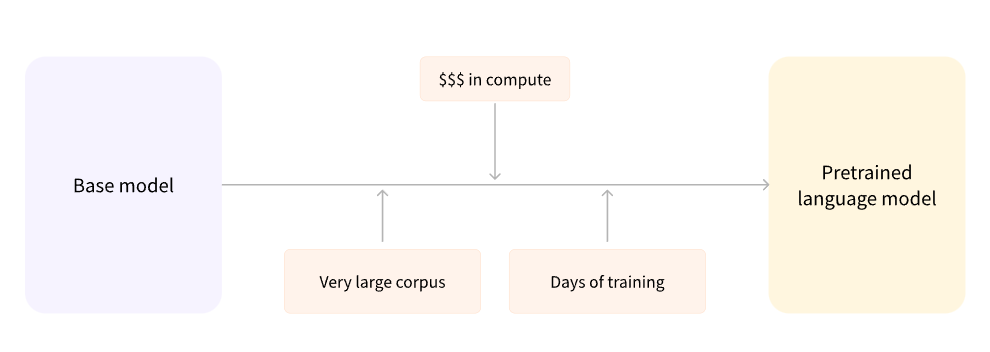

# LLM Models

Of course, the basics of NLP are skipped here would cover that in a different section. First, we will try to basket what the problem is with existing RNN, LSTM, and existing Models and how the introduction of one paper completely changed the ecosystem of NLP.&#x20;

The problems with RNN/LSTMS :&#x20;

1. Non-contextual Word Embeddings either be it Glove or Word2Vec these embeddings do not express the importance of the word in the sentence and hence are classified as noncontextual.&#x20;
2. Input is fed one by one which makes the process very slow.RNNs process input sequences sequentially, one element at a time. They maintain hidden states that capture information from previous steps and propagate it forward. The sequential nature of RNNs limits parallelization and can result in slower training and inference.

* [Attention is all you need](https://jalammar.github.io/illustrated-transformer/): This paper was introduced in 2018 and ever since the landscape has drastically changed.&#x20;
* ELMO: ELMo utilizes a bi-directional language model and combines hidden states from multiple layers to generate context-sensitive word embeddings. It focuses on capturing contextual information within a sentence.
* Generative Pretraining:
  *   This pretraining is usually done on very large amounts of data. Therefore, it requires a very large corpus of data, and training can take up to several weeks.

      &#x20;
*   Fine Tuning :&#x20;

    _Fine-tuning_, on the other hand, is the training done **after** a model has been pretrained. To perform fine-tuning, you first acquire a pretrained language model, then perform additional training with a dataset specific to your task. Wait — why not simply train directly for the final task? There are a couple of reasons:

    * The pretrained model was already trained on a dataset that has some similarities with the fine-tuning dataset. The fine-tuning process is thus able to take advantage of knowledge acquired by the initial model during pretraining (for instance, with NLP problems, the pretrained model will have some kind of statistical understanding of the language you are using for your task).
    * Since the pretrained model was already trained on lots of data, the fine-tuning requires way less data to get decent results.
    * For the same reason, the amount of time and resources needed to get good results are much lower.
* Roberta&#x20;
* Electra
* Bert and its variants
